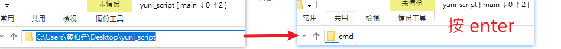
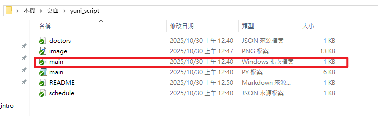

# 使用說明
## 1. 安裝 git
https://git-scm.com/install/windows
## 2. 在你想要使用腳本的資料夾路徑處, 輸入 cmd 並 enter

## 3. 在 終端機上貼上下列指令
```
$ git clone https://github.com/poting43/yuni_script.git
```
## 4. 左鍵雙擊 main.bat (main Windows 批次檔案), 即可執行腳本操作 
(之後只需要做這步就好~)



## 需要更新為最新版本時, 可以執行下面指令
```
$ git fetch origin
$ git reset --hard origin/master
```
